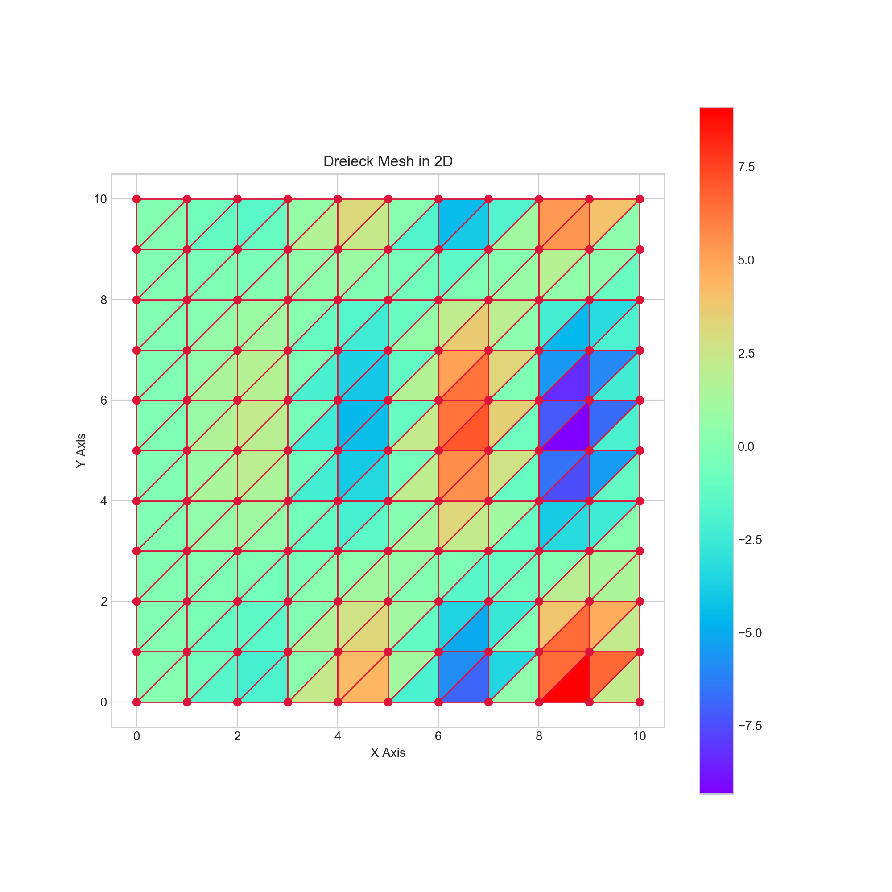

## Description

> Given a triangular mesh and an integer N, the script finds the first N hotspots, which are the elements where the function reaches its local maxima ordered by the function value starting from the biggest to the lowest.
Note: Comments and output messages are in German language.  

> Outputs:
> - List of N pairs (hotspot element ID, function value on this element) ordered by value from the biggest to the lowest.
> - a 2D triangular mesh 
    
## How to use

> ~ python3 hotspots.py filename N

> There is a log file available to show a sample input/output operation.

